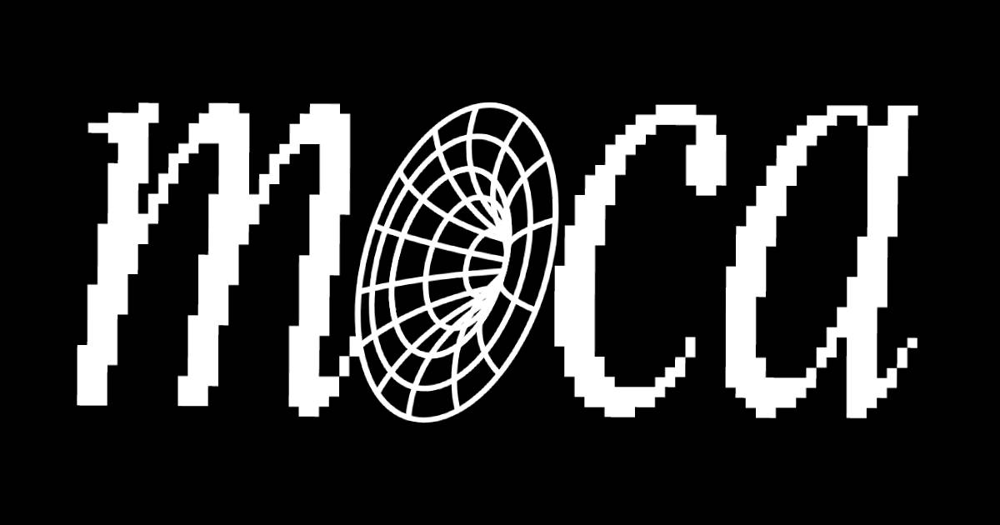

<div align="center">
  

  <h1>Museum of Crypto Art</h1>

  <p><strong>The open-source museum — collections, immersive 3D exhibitions, and an AI-powered Library.</strong></p>

  <p>
    <a href="https://museumofcryptoart.com">museumofcryptoart.com</a> ·
    <a href="https://museumofcryptoart.com/library">The Library</a> ·
    <a href="https://cortex.eco">Cortex</a> ·
    <a href="https://discord.gg/Rs7wxUTrWV">Discord</a> ·
    <a href="https://museumofcryptoart.com/manifesto">Manifesto</a>
  </p>

  <p>
    
    
    
    
    
    <a href="LICENSE"></a>
  </p>
</div>

---

At the Museum of Crypto Art (MOCA), we've reimagined what it means to be a Museum, bringing immersive art exhibitions, free tooling and software, high-level scholarship, and an engaging community atmosphere to a purely-online museum. MOCA is an industry leader in adapting new technologies —metaverse, blockchain, and AI— for practical application in a cultural institution.

We, however, envision a broader future, in which *any* cultural institution can deploy its own AI-powered museum. Therein, visitors can interact with curated and immersive exhibits alongside one another and alongside personalized AI agents, acting as curators and tour guides, each personalized to fit a given institution's vibe.

Welcome to our open-source museum, and the unprecedented possibilities it presents for cultural institutions forever.

Our mission, put simply: Provide a fully-deployable museum codebase where any enthusiast, collector, or cultural body can summon a top-tier curatorial, exhibitive, architectural, and artistic museum experience with ease. We're not just sharing software; we're democratizing access to a new paradigm in art experience.

**This repository is that museum** — the application serving [museumofcryptoart.com](https://museumofcryptoart.com). Rebuilt from the ground up in 2026 as a standalone Next.js experience, it is the culmination of years of MOCA tooling: the collections, the 3D exhibition world builder, the metaverse bridge into [Hyperfy](https://github.com/hyperfy-xyz/hyperfy) worlds, and **The Library** — our AI knowledge engine, powered by **[Cortex](https://cortex.eco)** ([docs.cortex.eco](https://docs.cortex.eco)).

## What the museum offers

1. **Art Collections** — The permanent collections, served live from MOCA's CMS backend and rendered server-side: masonry browsing, search and filtering, lightboxes, and curatorial essays. Point the app at your own backend and it displays *your* configured art — metadata and media alike (images, video, 3D).

2. **The Library** — A public, AI-powered knowledge engine for crypto art, the collection, and Web3 culture — streaming answers with source citations, an entity/relationship knowledge graph, and a Deep Research mode. The Library is powered by **[Cortex](https://cortex.eco)**, our agentic RAG platform: documents are ingested into Cortex, which builds knowledge graphs for high-end retrieval and exposes a streaming chat API. Cortex runs as its own service ([code: `mocaOS/cortex-app`](https://github.com/mocaOS/cortex-app) · [docs: docs.cortex.eco](https://docs.cortex.eco)); this app talks to it server-side and never exposes keys to the browser. The community feeds it: web3 visitors submit documents and websites, admins review, and approved knowledge flows into the Library's **Collective** collection.

3. **MOCA ROOMs & the world builder** — Originally launched in 2022, this [modular architecture](https://hackmd.io/@reneil1337/moca) enables the exhibition and transportation of entire art exhibitions across immersive worlds. `/rooms` renders every ROOM as an optimized 3D scene; `/rooms/world` is the **exhibition world builder** — place ROOMs on a grid with an RTS-style camera, hang artworks from the collections (or import a wallet's legacy Multipass curations) onto wall slots, and save named exhibits. Exhibitions then **spawn directly into self-hosted [Hyperfy](https://github.com/hyperfy-xyz/hyperfy) worlds** — walkable, solid rooms with distance-aware artwork LOD, proximity-gated video works, and an in-world slot editor for scene admins.

4. **Art DeCC0s as museum guides** — [Art DeCC0s](https://opensea.io/collection/art-decc0s) are 10,000 uniquely generated CC0 PFPs, and the face of agentic capabilities woven throughout the stack. In this app they come alive as the **museum guide**: an agentic VRM avatar spawned with every Hyperfy exhibition that visitors talk to in free-form chat — spatially aware of the rooms and the artworks around it, voiced via TTS, and backed by the Library for deep questions. Pick any DeCC0 persona (or bring your own SOUL.md) and download the guide as a drag-droppable `.hyp` app.

### Deploy your own museum

This frontend is fully self-contained: clone, `npm install`, `npm run dev` — or ship the Docker image. It runs against MOCA's public backends out of the box and every integration degrades gracefully when unconfigured, so you can start from zero keys and light features up one env var at a time. The full setup, environment, and deployment reference lives below.

This is a collaborative experiment, and we're building the scaffolding in public. If you're eager to dive deeper, contribute, or deploy your own museum, [hop into our Discord](https://discord.gg/Rs7wxUTrWV) — we'll guide you through the maze while we write the map.

---

# Technical reference

Built with **Next.js 16** (App Router, standalone output), **React 19**, **Tailwind CSS 4**, **react-three-fiber** for 3D, and **wagmi/viem + Reown AppKit** for web3.

- **Dev / container port:** `3331`
- **Canonical site URL:** `https://museumofcryptoart.com`
- **Library backend:** [Cortex](https://cortex.eco) — agentic RAG (knowledge graph + streaming chat), reached only server-side through this app's proxy. See [docs.cortex.eco](https://docs.cortex.eco).
- **CMS:** Directus (collections, NFTs, rooms) — read live, server-side.

## What's inside

| Route | What it is | Data source |
|---|---|---|
| `/` | Museum home — hero, featured collections, mission | Directus |
| `/collections` · `/collections/[slug]` | The permanent collection — masonry grid, search/filter, lightbox, curatorial essays | Directus |
| `/rooms` · `/rooms/[id]` | MOCA ROOMs — immersive 3D rooms (GLB) in a fullscreen R3F viewer | Directus |
| `/rooms/world` | **3D exhibition world builder** — place rooms on a grid, hang/curate artworks (from the museum collections or a wallet's legacy Multipass curations), save exhibits locally, export, and **spawn into [Hyperfy](https://github.com/hyperfy-xyz/hyperfy) worlds** (rooms, artworks, and an agentic museum-guide avatar) | Directus + localStorage |
| `/library` | **Public** Cortex chat — streaming answers, citations, source viewer | Cortex (server proxy) |
| `/library/review` | Admin review queue for community document submissions (SIWE-gated) | Directus + Cortex |
| `/writings` · `/timeline` · `/incubator` | Curated reading list, crypto-art history, Incubator program | Static (`src/content`) |
| `/manifesto` · `/press-room` · `/moca-live` · `/cortex` · `/decc0s` · `/soulweaver` | Content & program pages | Static |
| `/unstake` | Withdrawal UI for the legacy $MOCA staking pools (Polygon) | On-chain |
| `/llms.txt` | Agent-first site map | Generated |

The whole museum is **anonymous by default** — no accounts, no database. Web3 login (SIWE) exists only for community document submissions, the admin review queue, and the holder account view (holdings + personal Library API keys).

## Architecture

```
 Browser
   │  (never sees any API key)
   ├─ /collections /rooms ───── React Server Components ──► Directus REST
   ├─ artwork media ──────────────────────────────────────► transform proxy / IPFS gateway (fallbacks)
   ├─ /rooms/world ── R3F world builder ──► /api/museum/* (artworks, previews, model, texture, multipass)
   ├─ /writings /timeline /incubator ── static JSON in the bundle
   └─ /library ── /api/ask/stream (SSE proxy) ──► Cortex API
                    └─ injects X-API-Key server-side, strips gzip so tokens stream
```

- **Cortex is reached only through the server** (`/api/ask/stream`, `/api/proxy/*`). A single read-only key (`CORTEX_API_KEY`) powers the anonymous public Library; it never reaches the browser.
- **Galleries/rooms render server-side** from Directus (`src/lib/museum/directus.ts`) — SEO-friendly, no client credentials.
- **Media** (`src/lib/museum/media.ts`) routes images/videos through a transform proxy with IPFS-gateway fallbacks; many legacy `openseauserdata.com` source URLs are dead at origin but revived from cache.
- **3D pipeline** (`src/lib/museum/hyperfy/`, `/api/museum/model|texture`): room GLBs are recompressed on the fly (WebP textures, decoded geometry) and exhibition exports can be spawned into self-hosted Hyperfy v2 worlds — including an agentic, voice-enabled museum guide.
- **No database.** Exhibits live in the visitor's localStorage; the submission review queue lives in Directus; personal Library keys live in Cortex's key store. The container is stateless.

## Getting started

### Prerequisites

- Node.js 22+
- Optionally: a read-only **Cortex API key** (`cortex_ro_…`) for the Library

### Install & run (dev)

```bash
npm install
cp .env.example .env       # then fill in what you need (see below)
npm run dev                # http://localhost:3331
```

> The museum boots **without any keys** — collections, rooms, world builder, writings, and timeline all work. Each integration (Library chat, submissions, wallet holdings) simply reports "not configured" until its env is set.

## Environment variables

All secrets are **server-only, read at runtime**; only `NEXT_PUBLIC_*` values are inlined at build. `.env.example` documents every variable — the important ones:

| Variable | Purpose |
|---|---|
| `CORTEX_API_URL` / `CORTEX_API_KEY` | Cortex backend + single read-only key for the public Library. Unset → Library disabled, site still runs. |
| `CORTEX_MANAGEMENT_API_KEY` | Write-capable (`cortex_rw_`) key used **only** to ingest approved community submissions. |
| `CORTEX_ADMIN_API_KEY` | Admin-tier key that mints/revokes per-holder read-only Library API keys. |
| `DIRECTUS_URL` | Directus CMS (collections, NFTs, rooms). |
| `DIRECTUS_SUBMISSIONS_TOKEN` | Static token scoped to the `library_submissions` collection — the app's only Directus writer. |
| `IPFS_GATEWAY` / `IPFS_FALLBACK_GATEWAY` | Media gateways for `ipfs://` URIs. |
| `NEXT_PUBLIC_SITE_URL` | Canonical base URL for SEO/OG. **Build-time inlined.** |
| `NEXT_PUBLIC_REOWN_PROJECT_ID` | Reown AppKit project id (wallet connect modal). Public value. |
| `SESSION_SECRET` | HMAC secret for the SIWE session cookie (`openssl rand -hex 32`). Unset → sign-in disabled. |
| `LIBRARY_ADMIN_ADDRESSES` | Comma-separated ETH addresses allowed to review/approve submissions. |
| `MORALIS_API_KEY` | Lists NFT holdings (Art DeCC0s + MOCA ROOMs) in the account view. |
| `ETH_RPC_URL` / `POLYGON_RPC_URL` | JSON-RPC endpoints for $MOCA balances / staking reads (public fallbacks exist). |

> **Never** prefix a secret with `NEXT_PUBLIC_`.

## Build & run (production)

The app uses Next's **`output: "standalone"`**:

```bash
npm run build
PORT=3331 node --env-file=.env .next/standalone/server.js
```

### Docker

The multi-stage `Dockerfile` builds the standalone output and runs it as a non-root user on port **3331**. The container is **stateless** — no volumes needed.

```bash
docker build -t moca-museum .
docker run -p 3331:3331 --env-file .env moca-museum
```

### docker-compose / Coolify / Dokploy

`docker-compose.yml` is the deployment target for managed platforms:

1. Create a Docker Compose resource pointing at this repo (build context is the repo root).
2. Set the environment variables (all runtime except `NEXT_PUBLIC_*`).
3. Point your domain (e.g. `museumofcryptoart.com`) at container port **3331**; the platform's proxy terminates TLS.
4. Deploy — the public site is immediately live; each integration activates as soon as its env is present.

```bash
docker compose up -d --build
```

## Content management

- **Collections, NFTs, rooms** are live from **Directus** — edit in the CMS, changes appear immediately.
- **Writings, Timeline, Incubator** are static JSON under `src/content/` — edit and redeploy.
- **Community submissions**: web3 users submit documents/URLs for the Library; whitelisted admins approve them at `/library/review`, which ingests them into the Cortex "Collective" collection.

## Project structure

```
src/
├── app/
│   ├── (site)/                 # public museum chrome — home, collections, rooms index,
│   │   │                       #   writings, timeline, incubator, manifesto, press-room,
│   │   │                       #   moca-live, cortex, decc0s, soulweaver, unstake
│   ├── (fullscreen)/rooms/     # 3D room viewer + the world builder (/rooms/world)
│   ├── library/                # public Cortex chat + /library/review (admin queue)
│   ├── api/
│   │   ├── ask/stream/         # SSE Cortex proxy (key injected server-side)
│   │   ├── proxy/[...path]/    # generic Cortex read proxy
│   │   ├── museum/             # artworks, collections, previews, multipass,
│   │   │                       #   model (GLB optimizer), texture (HQ proxy)
│   │   ├── auth/               # SIWE (nonce, verify, session, logout)
│   │   ├── library/submissions/  # submit + approve/reject queue
│   │   ├── holdings/ keys/ stakes/  # web3 account surfaces
│   └── llms.txt/               # agent-first site map
├── components/
│   ├── site/                   # SiteHeader, SiteFooter
│   ├── museum/                 # gallery grid, lightbox, rooms browser, …
│   │   └── three/              # Room3DViewer, WorldBuilder, Hyperfy spawn dialog
│   ├── wallet/                 # Reown AppKit provider, SIWE login
│   └── …                       # Library chat UI
├── content/                    # static JSON: writings, timeline, incubator
└── lib/
    ├── museum/                 # directus.ts (data layer), media.ts, hyperfy/ (spawner,
    │                           #   wire protocol, room/guide scripts, .hyp builder)
    ├── library/                # submissions + Cortex management client
    └── web3/                   # holdings, staking reads
scripts/                        # one-off utilities (room optimization, scrapers)
```

## Notes & caveats

- **`openseauserdata.com` is shut down.** Affected artworks are revived via the media transform proxy; the raw URL is the fallback.
- **3D is client-only.** The R3F viewer/world builder are dynamically imported with `ssr: false`.
- **Hyperfy spawning** targets self-hosted [Hyperfy](https://github.com/hyperfy-xyz/hyperfy) v2 worlds (pinned wire protocol v0.16.0) — a world URL + admin key is all it takes.

## Tech stack

Next.js 16 · React 19 · TypeScript 5 · Tailwind CSS 4 · @react-three/fiber + drei + three.js · @directus/sdk · wagmi + viem + Reown AppKit · Moralis · gltf-transform + sharp (server-side GLB/texture optimization) · msgpackr (Hyperfy wire protocol) · react-markdown + remark-gfm · Docker (standalone output).

## Links

- **Museum**: [museumofcryptoart.com](https://museumofcryptoart.com)
- **The Library / Cortex**: [cortex.eco](https://cortex.eco) · [docs.cortex.eco](https://docs.cortex.eco) · [`mocaOS/cortex-app`](https://github.com/mocaOS/cortex-app)
- **MOCA tech stack (backend, agents, tooling)**: [`mocaOS/museum`](https://github.com/mocaOS/museum)
- **Discord**: [discord.gg/Rs7wxUTrWV](https://discord.gg/Rs7wxUTrWV)

## License & notices

The source code is released under the **[MIT License](LICENSE)** — © 2026 Museum of Crypto Art.

- **Trademarks & brand assets.** The Museum of Crypto Art name, the M○C△ / MOCA wordmarks and logos, and the brand imagery in this repository are **not** covered by the MIT license and may not be used to represent or endorse your own deployment without permission. Fork the code, rebrand your museum.
- **Fonts.** Inter and JetBrains Mono (`public/fonts/`) are distributed under the SIL Open Font License 1.1 — see [`public/fonts/LICENSE-Inter.txt`](public/fonts/LICENSE-Inter.txt) and [`public/fonts/LICENSE-JetBrainsMono.txt`](public/fonts/LICENSE-JetBrainsMono.txt).
- **Wallet connect (Reown AppKit).** The wallet modal depends on Reown AppKit / WalletConnect, which since August 2025 ship under the [Reown Community License](https://github.com/reown-com/appkit/blob/main/LICENSE.md) (not open source: free below usage thresholds, commercial above). Their code is not part of this repository — you accept Reown's terms when installing dependencies. The museum runs fine without a `NEXT_PUBLIC_REOWN_PROJECT_ID` if you don't need wallet features.

---

<div align="center">

*"At its core, the Museum of Crypto Art (M○C△) challenges, creates conflict, provokes. M○C△ puts forward a broad representation of perspectives meant to upend our sense of who we are. It poses two questions: 'what is art?' and 'who decides?'"*

</div>
